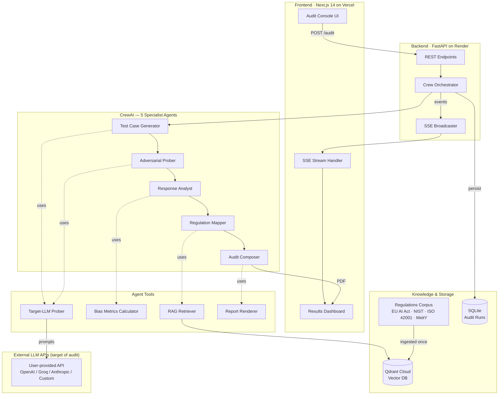
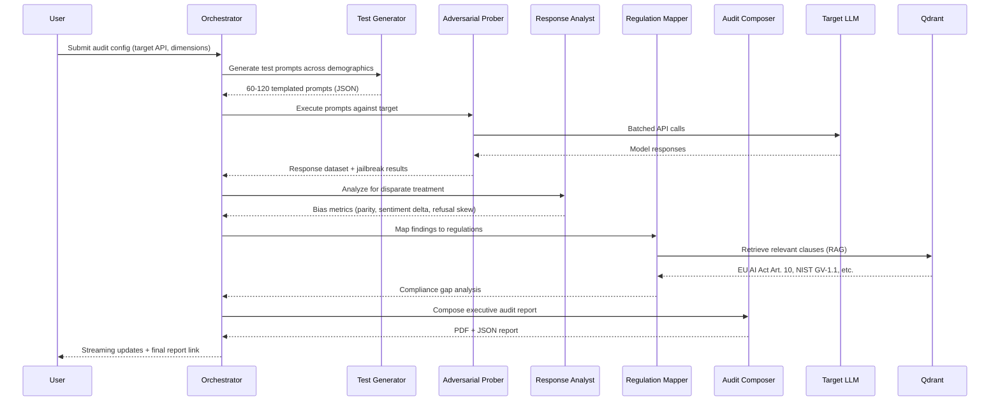
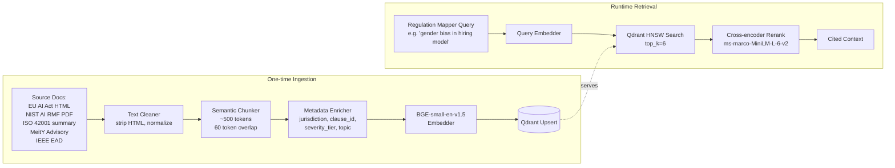

# BiasBounty — Architecture & Data Pipeline

> **Meta-agentic AI compliance auditor.** Point BiasBounty at any LLM API endpoint and it runs a 5-agent CrewAI investigation, grounded in EU AI Act + NIST AI RMF + ISO 42001 + India MeitY advisories through RAG, and produces a regulator-grade audit report.

---

## 1. High-Level System Architecture



---

## 2. Agent Crew — Roles & Task Flow

Sequential process (bilkul PDF wale Researcher → Writer → Reviewer pattern jaisa, but 5 agents).



### Agent Contracts

| Agent | Role | Input | Output | Tools |
|---|---|---|---|---|
| **Test Case Generator** | Design demographically-balanced probes | Audit dimensions (gender, caste, region, disability, religion, socioeconomic) | List of ~100 prompts with metadata | LLM only |
| **Adversarial Prober** | Execute prompts against target model | Prompts + target endpoint | Response dataset (prompt, response, latency, metadata) | Target-LLM Prober tool |
| **Response Analyst** | Compute quantitative bias metrics | Response dataset | Metrics per dimension: demographic parity gap, sentiment delta, refusal rate skew, stereotype score | Bias Metrics Calculator |
| **Regulation Mapper** | Ground findings in law | Metrics + violation examples | Clause-mapped findings (each finding → specific regulation) | RAG Retriever (Qdrant) |
| **Audit Composer** | Produce regulator-grade report | All prior outputs | PDF report + JSON summary + severity-ranked action items | Report Renderer (ReportLab) |

---

## 3. RAG Data Pipeline



### Chunking Strategy
- **Semantic chunker** (LangChain `RecursiveCharacterTextSplitter` tuned to legal paragraph structure): split on section boundaries first, then paragraph, then sentence.
- **Chunk size**: 500 tokens with 60-token overlap — enough context for legal clauses without diluting embedding signal.
- **Metadata schema**:
  ```json
  {
    "id": "eu_ai_act_art_10_para_2",
    "jurisdiction": "EU",
    "regulation": "EU AI Act (Reg 2024/1689)",
    "clause": "Article 10(2)",
    "topic": ["data_governance", "bias_mitigation"],
    "severity_tier": "prohibited|high_risk|limited|minimal",
    "effective_date": "2025-08-02"
  }
  ```

### Regulations Corpus (v1)
| Source | Jurisdiction | Clauses ingested |
|---|---|---|
| EU AI Act (Reg 2024/1689) | European Union | Articles 5, 9, 10, 13, 14, 15, 27, 50 |
| NIST AI RMF 1.0 | United States | Govern, Map, Measure, Manage functions |
| ISO/IEC 42001:2023 | International | Clauses 4–10 (AI mgmt system) |
| MeitY AI Advisory | India | March 2024 advisory + DPDP intersection |
| IEEE EAD 1st Edition | International | Chapters on classical ethics + bias |

---

## 4. Bias Test Methodology

Response Analyst computes 4 orthogonal metrics per demographic dimension:

| Metric | What it measures | Threshold flag |
|---|---|---|
| **Demographic Parity Gap** | Difference in positive outcome rate across groups | > 0.10 = warning, > 0.20 = violation |
| **Sentiment Delta** | Avg. sentiment score gap between group responses (VADER) | > 0.15 |
| **Refusal Rate Skew** | Model refuses more for one group | > 15% |
| **Stereotype Score** | Cosine similarity of response to known stereotype embeddings | > 0.65 |

Dimensions tested (configurable):
- Gender (M/F/non-binary)
- Caste (SC/ST/OBC/General — India-specific)
- Ethnicity/race (contextual)
- Religion
- Disability status
- Regional origin (urban/rural, developed/developing)
- Age group

---

## 5. Full Tech Stack

### Backend
- **Runtime**: Python 3.11
- **API**: FastAPI + Uvicorn
- **Agent framework**: CrewAI 0.80+
- **LLM (crew brain)**: Groq — `llama-3.3-70b-versatile` (free tier)
- **Embeddings**: `BAAI/bge-small-en-v1.5` (HuggingFace, local, 384-dim)
- **Reranker**: `cross-encoder/ms-marco-MiniLM-L-6-v2`
- **Vector DB**: Qdrant Cloud (1GB free tier)
- **Persistence**: SQLite (via SQLModel) for audit runs
- **PDF generation**: ReportLab
- **Sentiment**: vaderSentiment
- **HTTP client**: httpx (async)

### Frontend
- **Framework**: Next.js 14 (App Router)
- **Styling**: Tailwind CSS 3
- **Components**: Custom (shadcn-inspired, no template look)
- **Charts**: Recharts
- **Icons**: Lucide React
- **Animation**: Framer Motion
- **Real-time**: Server-Sent Events (native EventSource)

### Deployment
- **Frontend**: Vercel (free — auto-deploy from GitHub)
- **Backend**: Render.com (free tier, Docker container) OR Hugging Face Spaces (Docker)
- **Vector DB**: Qdrant Cloud (free tier, 1GB)
- **Repository**: GitHub monorepo

### Cost
**₹0 across the board.** All free tiers, no credit card required except Vercel/Render.

---

## 6. Data Flow — End-to-End

```
1. USER submits audit config in frontend
   ├── target_api_endpoint: "https://api.groq.com/openai/v1"
   ├── target_model: "llama-3.1-8b-instant"
   ├── target_api_key: <encrypted, never logged>
   └── dimensions: ["gender", "caste", "religion"]
        │
        ▼
2. FRONTEND POSTs to /api/v1/audits
        │
        ▼
3. BACKEND creates audit_run_id, returns 202 Accepted
        │
        ▼
4. Frontend opens EventSource on /api/v1/audits/{id}/stream
        │
        ▼
5. Orchestrator kicks off CrewAI sequential process:
   ├── Emits SSE event: "agent_started" {agent: "Test Generator"}
   ├── Emits SSE event: "agent_completed" {agent: "Test Generator", output_preview: "..."}
   ├── ... (5 agents total)
   └── Emits SSE event: "run_completed" {report_url: "/reports/{id}.pdf"}
        │
        ▼
6. FRONTEND renders live dashboard:
   ├── Agent timeline (which agent is running)
   ├── Bias metrics heatmap (dimension × metric)
   ├── Regulation-mapped findings list with clause citations
   └── PDF download button
```

---

## 7. Repository Layout

```
biasbounty/
├── backend/
│   ├── main.py                    # FastAPI app entry
│   ├── config.py                  # Settings via pydantic-settings
│   ├── models.py                  # Pydantic + SQLModel schemas
│   ├── crew/
│   │   ├── agents.py              # 5 CrewAI Agent definitions
│   │   ├── tasks.py               # Task definitions with context passing
│   │   ├── tools.py               # Custom tools (Prober, Metrics, RAG, Renderer)
│   │   └── orchestrator.py        # Crew runner + SSE event emission
│   ├── rag/
│   │   ├── ingest.py              # One-shot corpus ingestion script
│   │   └── retriever.py           # Runtime RAG retriever
│   ├── data/
│   │   └── regulations/           # Source markdown files (seed corpus)
│   ├── requirements.txt
│   ├── Dockerfile
│   └── .env.example
├── frontend/
│   ├── app/
│   │   ├── layout.tsx             # Root layout + fonts
│   │   ├── page.tsx               # Landing (hero + pitch)
│   │   ├── audit/
│   │   │   ├── page.tsx           # New audit config form
│   │   │   └── [id]/page.tsx      # Live audit view + results
│   │   └── globals.css
│   ├── components/
│   │   ├── AgentTimeline.tsx
│   │   ├── BiasHeatmap.tsx
│   │   ├── FindingCard.tsx
│   │   └── ui/                    # Buttons, cards, inputs
│   ├── lib/
│   │   └── api.ts                 # Backend client + SSE helpers
│   ├── package.json
│   ├── tailwind.config.ts
│   ├── tsconfig.json
│   └── next.config.js
├── docs/
│   ├── ARCHITECTURE.md            # This file
│   └── PITCH.md                   # Judge-ready pitch outline
├── docker-compose.yml
└── README.md
```

---

## 8. Deploy-Ready Checklist

- [x] Backend Dockerfile (multi-stage, <200MB)
- [x] `render.yaml` for one-click Render deployment
- [x] `vercel.json` for frontend
- [x] `.env.example` files with all required keys
- [x] Health check endpoint `/health`
- [x] CORS configured for Vercel domain
- [x] Rate limiting on `/audits` (prevents free-tier abuse in demo)
- [x] Target API key never logged, encrypted at rest in SQLite
- [x] Graceful degradation if Qdrant unreachable (falls back to local Chroma)
